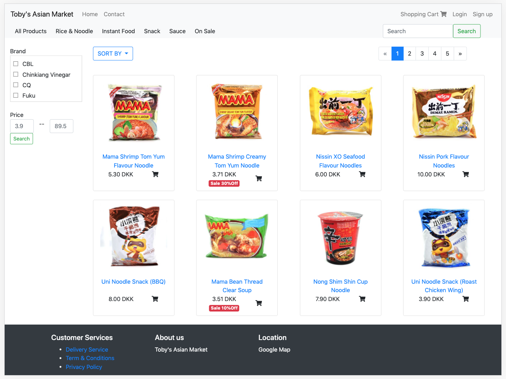
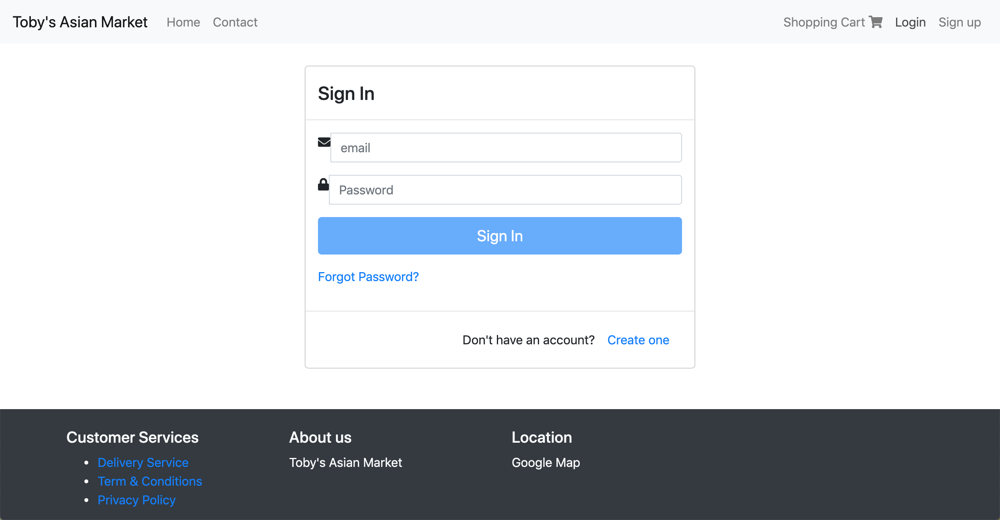
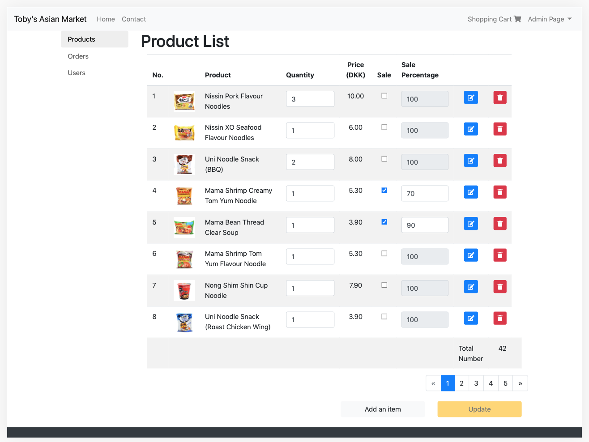
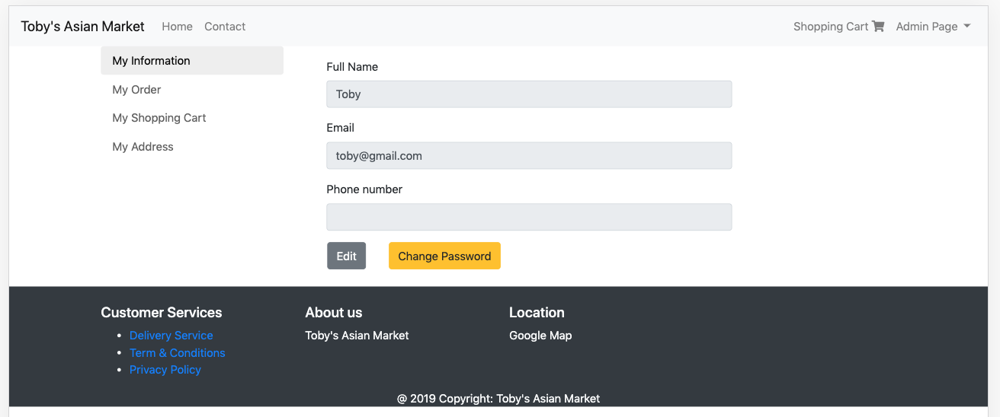
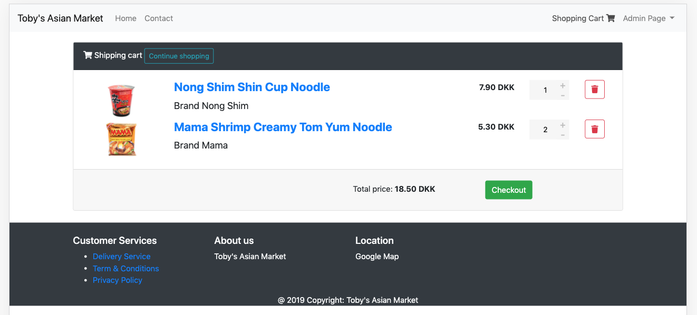
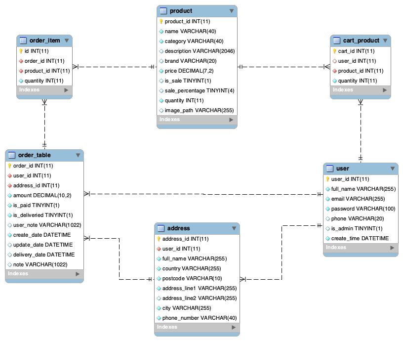

# Toby's Asian market
A shopping website for an Asian grocery store. Features includes product browsing/searching/categorization, shopping cart, user/admin interfaces, product/order management.

## Built With

* [BootStrap 4](https://getbootstrap.com/docs/4.0/getting-started/introduction/) - CSS framework
* [Angular 6](https://angular.io/) - Web application framework, frontend 
* [Spring Boot](https://spring.io/projects/spring-boot)- Spring Boot RESTful API, backend services
* [MySQL](https://www.mysql.com/) - Database management

## Website pages

**Homepage**

**Login page**

**Admin page**

**User page**

**Shopping cart page**

**Database diagram**

## License

This project is licensed under the [MIT License](LICENSE).
